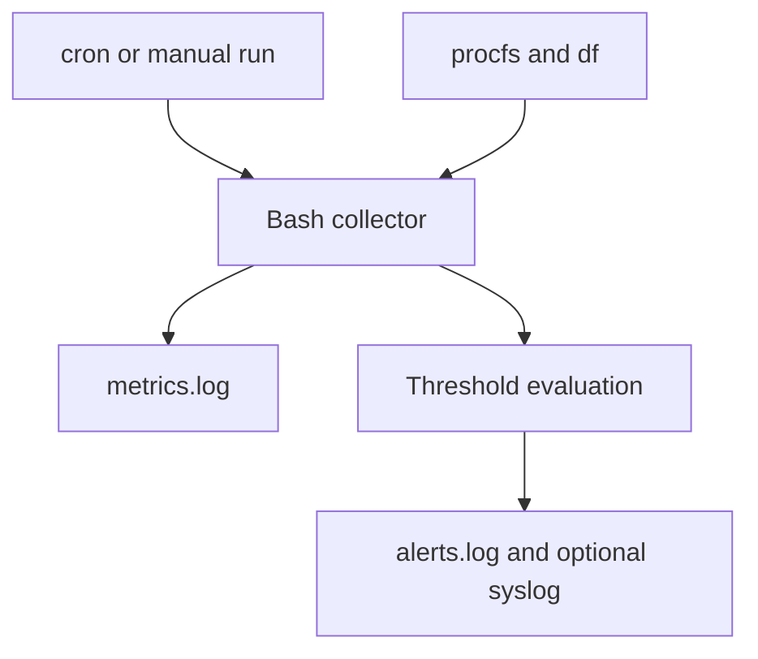
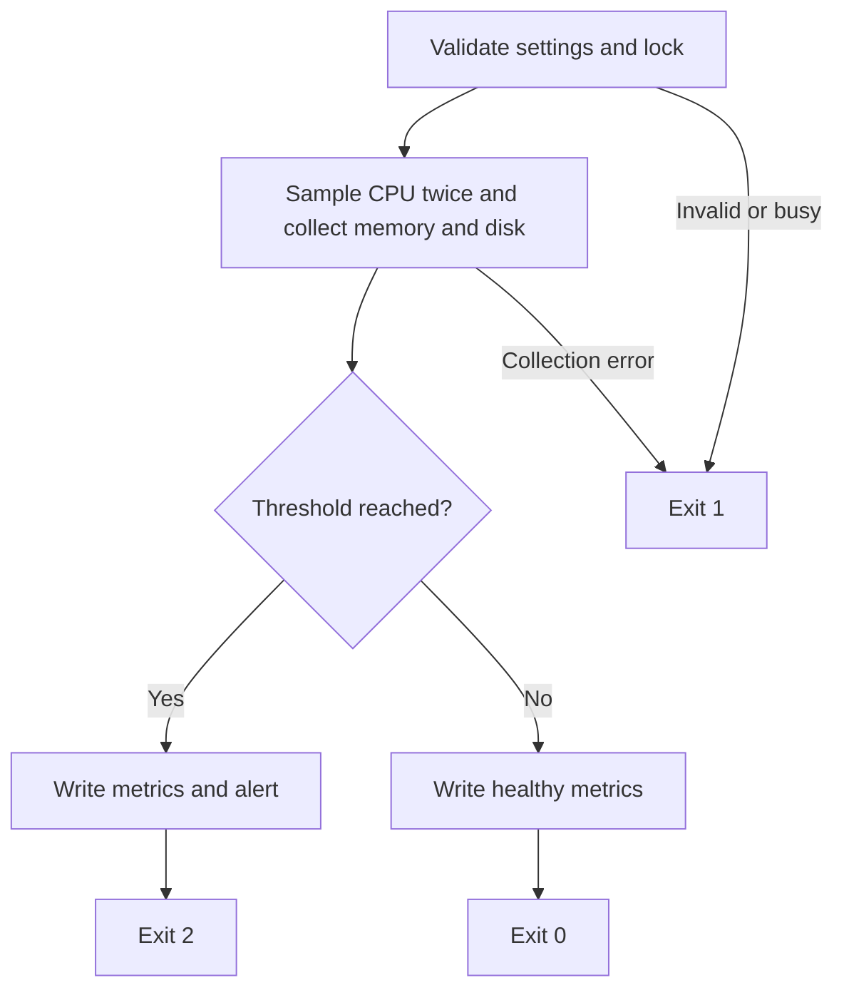
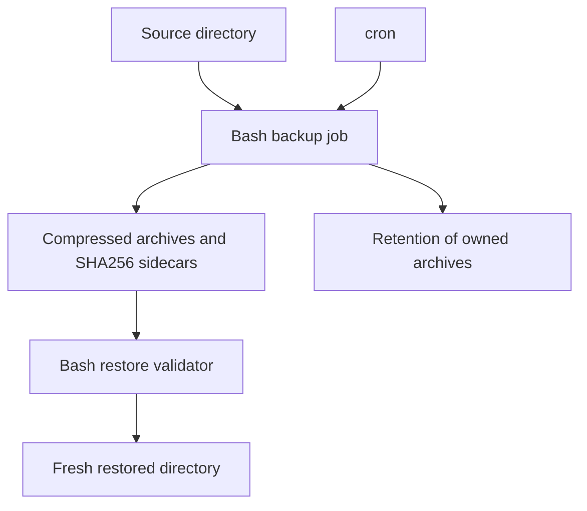
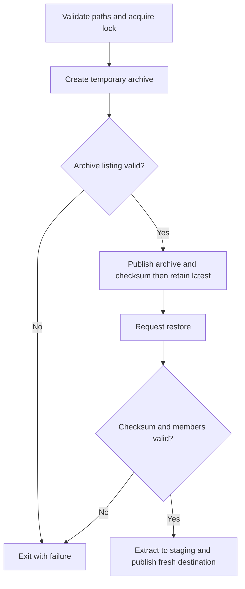
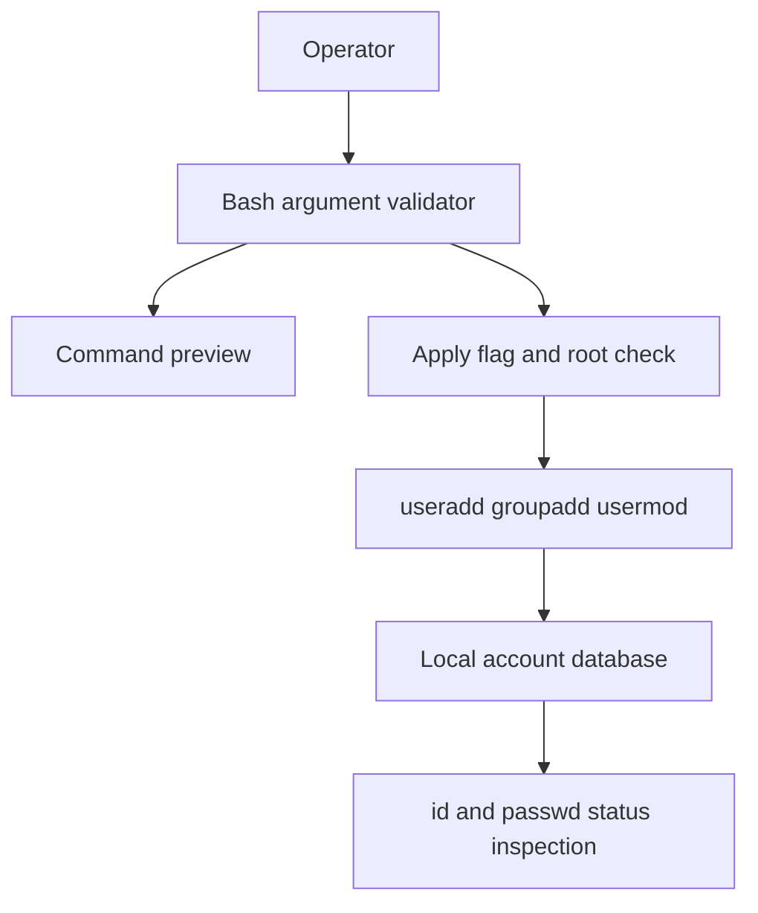
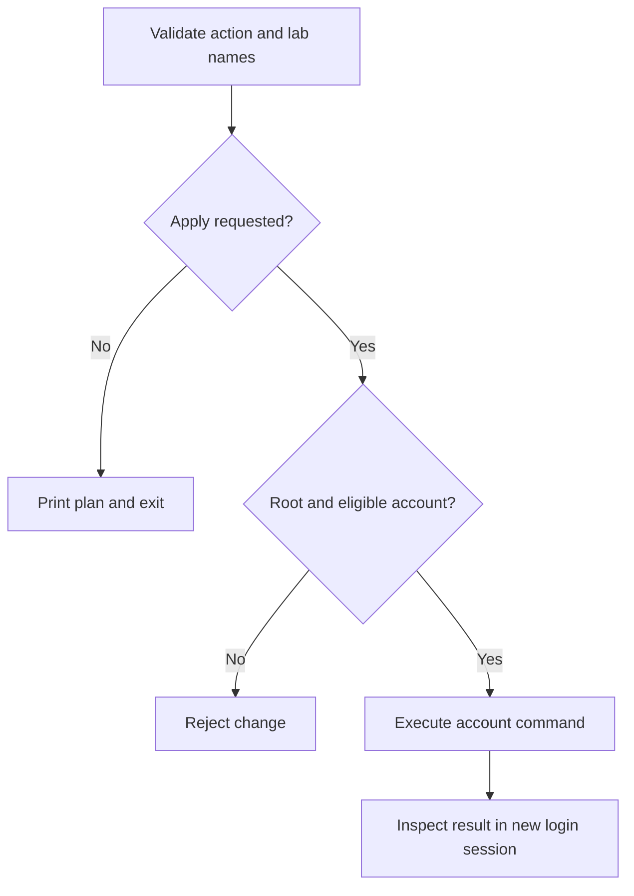

# Architecture and Flow Diagrams

## Monitoring

Architecture:

```mermaid
flowchart TD
    C["cron or manual run"] --> B["Bash collector"]
    P["procfs and df"] --> B
    B --> M["metrics.log"]
    B --> T["Threshold evaluation"]
    T --> A["alerts.log and optional syslog"]
```
Flow:

```mermaid
flowchart TD
    V["Validate settings and lock"] --> S["Sample CPU twice and collect memory and disk"]
    S --> Q{"Threshold reached?"}
    Q -->|Yes| A["Write metrics and alert"]
    Q -->|No| H["Write healthy metrics"]
    A --> E["Exit 2"]
    H --> O["Exit 0"]
    V -->|Invalid or busy| F["Exit 1"]
    S -->|Collection error| F
```

## Backup and recovery

Architecture:

```mermaid
flowchart TD
    S["Source directory"] --> B["Bash backup job"]
    C["cron"] --> B
    B --> A["Compressed archives and SHA256 sidecars"]
    A --> R["Bash restore validator"]
    R --> D["Fresh restored directory"]
    B --> K["Retention of owned archives"]
```
Flow:

```mermaid
flowchart TD
    V["Validate paths and acquire lock"] --> T["Create temporary archive"]
    T --> I{"Archive listing valid?"}
    I -->|No| X["Exit with failure"]
    I -->|Yes| P["Publish archive and checksum then retain latest"]
    P --> R["Request restore"]
    R --> C{"Checksum and members valid?"}
    C -->|No| X
    C -->|Yes| D["Extract to staging and publish fresh destination"]
```

## User management

Architecture:

```mermaid
flowchart TD
    O["Operator"] --> V["Bash argument validator"]
    V --> P["Command preview"]
    V --> G["Apply flag and root check"]
    G --> U["useradd groupadd usermod"]
    U --> D["Local account database"]
    D --> I["id and passwd status inspection"]
```
Flow:

```mermaid
flowchart TD
    V["Validate action and lab names"] --> Q{"Apply requested?"}
    Q -->|No| P["Print plan and exit"]
    Q -->|Yes| R{"Root and eligible account?"}
    R -->|No| F["Reject change"]
    R -->|Yes| E["Execute account command"]
    E --> I["Inspect result in new login session"]
```
